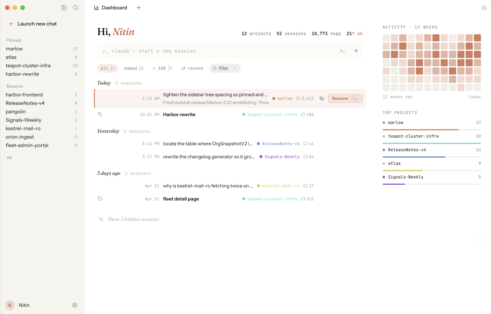
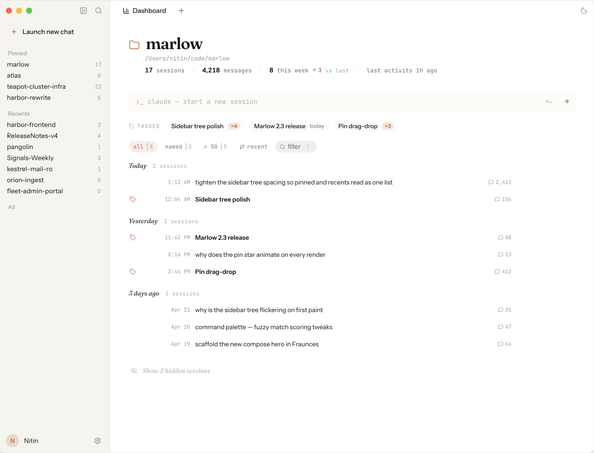
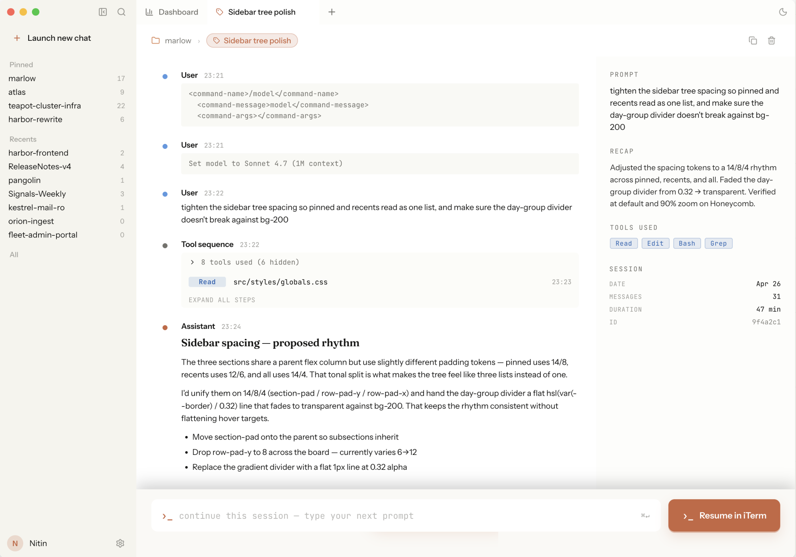

# Loom

Desktop app for browsing and resuming [Claude Code](https://claude.com/claude-code) CLI sessions on macOS.

<picture>
  <source media="(prefers-color-scheme: dark)" srcset="docs/screenshots/dashboard-dark.png">
  
</picture>

Claude Code is great for doing the work, but finding what you did two weeks ago means grep'ing UUID-named JSONL files, and resuming a specific chat means scrolling the `claude --resume` menu. Loom reads your `~/.claude/projects/` archive and turns it into a browseable timeline. The Dashboard shows recent activity across every project; clicking one opens its session list. You can resume any session — or start a new one — in iTerm with a single click.

## Features

**Browse**
- **Dashboard** — recent activity across every project, with week-over-week deltas and a compose box for starting a new chat anywhere.
- **Project view** — sessions grouped by day, filterable (`all` / `named` / `>50 messages` / `recent`), with hover recap cards distilled from the last assistant turn.
- **Session view** — full transcript with rich rendering for Bash, file edit, Todo, and Web tool calls. Auto-refreshes as Claude appends new turns to the JSONL.
- **⌘K palette** — fuzzy-search across projects, first-prompts, and `/title`-labeled sessions.

**Organize**
- **Smart titles** — finds the real first prompt, skipping slash-command wrappers and compaction preambles. Rename any session with `/title`.
- **Tagged sessions** — sessions sharing a `/title` auto-group into chips on the project header (`Sidebar tree polish ×4`), so recurring threads stay one click away.
- **Per-project color** — pick a hue from the project picker; it threads through the dashboard, sidebar, and session rows.
- **Pin / hide** — pin frequently-used projects to the sidebar; hide stale ones from Loom (reversible, leaves Claude's archive untouched).

**Resume**
- **Terminal launch** — one click runs `claude --resume <id>` in iTerm (Terminal.app fallback), with tmux-CC timing handled. New chats launch with `cd <project>; claude` and an optional pre-filled prompt.
- **Customizable launch templates** — override the resume and new-chat commands in Settings (`{projectPath}`, `{sessionId}`, `{query}` placeholders).

**Safe by default**
- Reads your `~/.claude/projects/` archive — never writes to it. **Hide** is Loom-only and reversible; **Delete** moves the JSONL to macOS Trash, so `claude --resume` also loses it.
- No server, no telemetry, no cloud sync. Everything runs locally in a Tauri shell. Three themes: Light, Dark, Honeycomb.

## Screenshots

### Project view

<picture>
  <source media="(prefers-color-scheme: dark)" srcset="docs/screenshots/project-dark.png">
  
</picture>

### Session view

<picture>
  <source media="(prefers-color-scheme: dark)" srcset="docs/screenshots/session-dark.png">
  
</picture>

## Setup

Loom is a Tauri app — Node builds the React/Vite frontend, Rust compiles the native macOS shell.

Each line below installs only if the tool is missing (`||` short-circuits when the version check succeeds):

```bash
node --version  || brew install node
cargo --version || brew install rust
```

Then build and launch the Mac app:

```bash
git clone https://github.com/jainnitin/loom.git
cd loom
npm install
npm start          # builds Loom.app and opens it
```

The build is ad-hoc signed locally — on first launch macOS will block it; right-click the app → **Open** → **Open**. Drag `Loom.app` into `/Applications` if you want it in Spotlight.

Other scripts:

- `npm run build` — same build as `npm start` but doesn't auto-open. Use this when distributing the DMG.
- `npm run dev` — runs the desktop app against Vite's dev server with HMR. Use this for frontend work.

## Stack

Tauri 2 · React 19 · Vite · TypeScript · Zustand · Tailwind v4.

## Credits

Fork of [esc5221/claude-code-viewer](https://github.com/esc5221/claude-code-viewer). Path resolution from [shukebeta](https://github.com/shukebeta). MIT.
